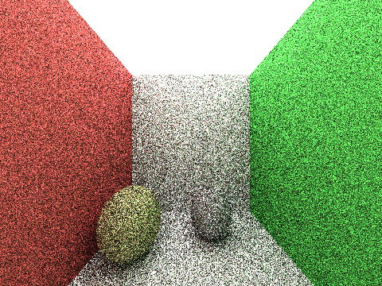
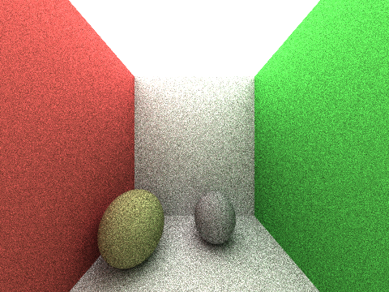
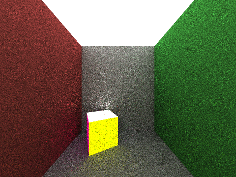
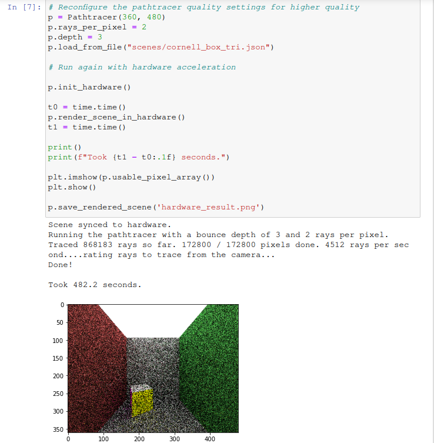

# hwsw-pathtracer

Monte Carlo path tracers are programs that perform three-dimensional scene
rendering by simulating bouncing rays of light for a random sample of rays in the
scene. With proper modeling of surface behavior and light sources in the scene,
impressively realistic renders can be achieved given sufficient compute.

The aim of this project is to implement a path tracer that runs in software on the
processing system (PS) of a Zynq7020 SoC, and then shift the actual tracing
algorithm onto the programmable logic (PL) of the system to explore the possibility
of speeding up the tracing via greatly increased parallelism.

You can now [run the hardware/software integrated version of the project](#running-the-hardware--software-implementation).

## Software implementation

The initial software implementation consists of a single python module in the
`pathtracer.py` file, which contains all the logic for performing basic
path tracing.

The core of the path tracing application is the procedure for tracing a single ray
of light throughout the scene and calculating what color that ray is (as seen by
the camera in the scene). In the software implementation, this is fully functional,
and rays are made to bounce off of scene objects (via intersection calculations)
until they reach a light source, or hit the bounce depth limit. They accumulate
color as they bounce, and return the result to be used in calculating the color
for the associated pixel in the final render. This procedure is repeated for as
many rays as necessary to calculate the colors of all of the pixels in the render.

The capabilities of the basic software pathtracer include:
- loading scenes to render from a JSON file
- supporting diffuse triangle, sphere, and plane primitives as scene objects
- configurable camera settings
- configurable number of bounces / number of rays fired per render pixel
- outputting final renders to files on disk

### Running the software implementation

Put the contents of the `python/` directory somewhere on
the filesystem of the device you would like to run on.
Then navigate to that location in a terminal and invoke
the test script with `python3 ./run.py`

This will result in the scene render being saved on disk to
`test_render_result.png`. You can open this however you like to view it.
Or, if you put the code below in a jupyter notebook, and run it, then
the image will additionally render in the notebook for your convenience.

Alternatively, input the following code into a jupyter notebook,
or an interactive python shell and run in that way.

```python
from pathtracer import *
import matplotlib.pyplot as plt

p = Pathtracer()
p.rays_per_pixel = 1     # This can be increased to increase quality.
p.depth = 4              # This can be increased to increase quality.
p.load_from_file("scenes/cornell_box.json")
p.render_scene()

plt.imshow(p.usable_pixel_array())
plt.show()

p.save_rendered_scene('test_render_result.png')
```

## Hardware implementation

The hardware implementation for the project is functional. The hardware IP
is generated from either the code in the `hls-v3/` or the `hls-v4/` directory. The
`pathtracer.py` file contains code to integrate the hardware IP into
the pathtracing procedure, and is useable on the PYNQ.

- The `hls-v3/` directory is a hardware design leveraging floating point calculations and 8-fold parallelism.
- The `hls-v4/` directory is the hardware design leveragin 16 bit fixed point calculations and pipelining.

The part of the path tracing algorithm that has been shifted on the programmable
logic is the ray casting and intersection finding part of the algorithm. In order
to have this improve efficiency, groups of rays are sent over all at the same time
to the hardware block to be cast into the scene in parallel.

The hardware-integrated version of the pathtracer has the same capabilities
as the software version, except it cannot trace sphere primitives.

### Running the hardware / software implementation

The recommended way to test the hardware and software implementations and see
results is to use all the resources from the `demo/` directory.

Steps to run:
1. copy the entire directory onto the PYNQ board.
2. move the `.bit` and `.hwh` files to a new overlay directory called `raycast` on the PYNQ board.
3. run the project_demo jupyter notebook
4. experiment as desired - the notebook file makes pretty clear what you can adjust
    a. you can change the render dimensions when initializing a pathtracer
    b. you can adjust how many rays are shot per pixel
    c. you can adjust how long rays can bounce for
    d. you can select the input json scene to use to trace

## Project structure

```
.
├── assets
│   └── ...
├── demo
│   ├── hardware_result.png
│   ├── pathtracer.py -> ../python/pathtracer.py
│   ├── project_demo.ipynb
│   ├── raycast.bit
│   ├── raycast.hwh
│   └── scenes -> ../python/scenes
├── hls                         # Initial attempt at HLS code
│   └── ...
├── hls-v2                      # Second, better attempt at HLS
│   └── ...
├── hls-v3                      # First working attempt at HLS - floating point, 8x parallel
│   └── ...
├── hls-v4                      # Second working attempt at HLS - 16 bit fixed point, pipelined
│   └── ...
├── python                      # Python implementation
│   ├── pathtracer.py             # The main software implementation file
│   ├── run.py                    # Sample script to run the pathtracer
│   ├── run_grouped_hw.py         # Sample script to run on hardware
│   └── scenes                    # Scenes that the pathtracer can render
│       ├── box_simple.json
│       ├── cornell_box.json
│       ├── cornell_box_tri.json
│       └── light_plane.json
├── README.md
└── UPDATE.md
```
## Sample results

Note that the first two results are captured on a machine with a decent CPU, and
still take a little while to render. On the PS of the PYNQ board, such renders take
far longer.

#### Rendering a basic Cornell box scene with two spheres in the scene


#### Rendering the same scene with a higher ray count


#### Rendering a similar high quality scene


#### Running in software on the XILINX PYNQ setup

Note the running time here - over 15 minutes for the worst possible render.
Not great! We will aim to improve that via hardware acceleration and
possibly some software tricks as well. Also note that this is running on a scene
with lower exposure, thus the dark scene. If you run it yourself you will get a
brighter result due to the scene having been updated since this run was performed.


#### Running in hardware on the XILINX PYNQ setup

Note the running time here - much better than the software performance, and on
a more complex scene as well!


