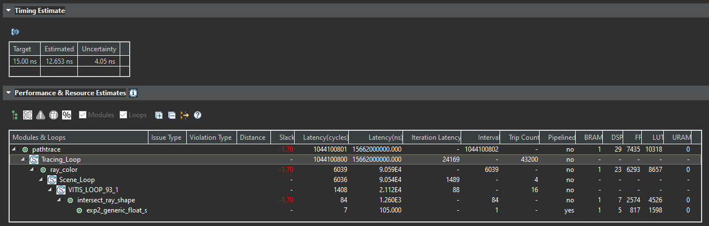
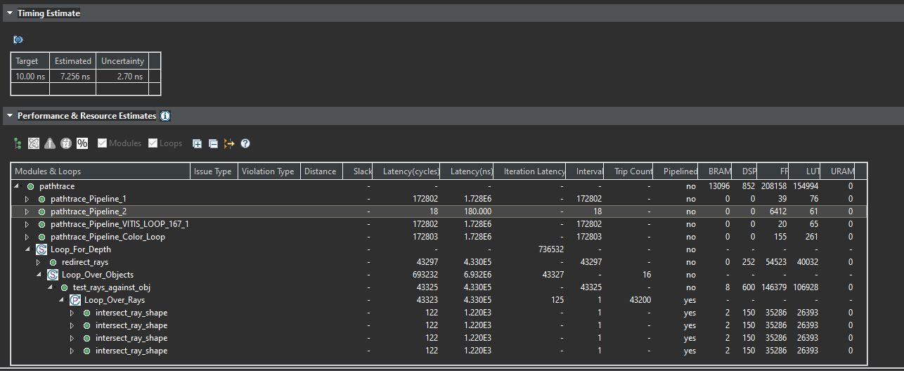
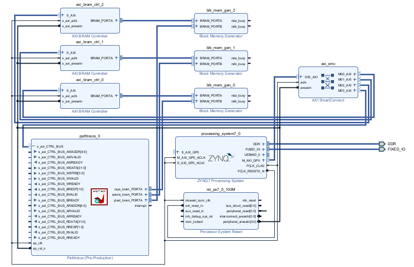
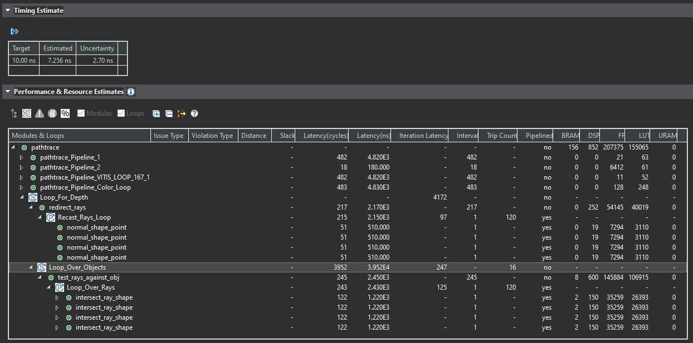
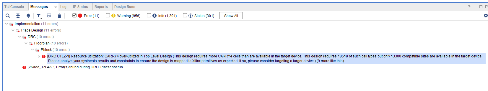
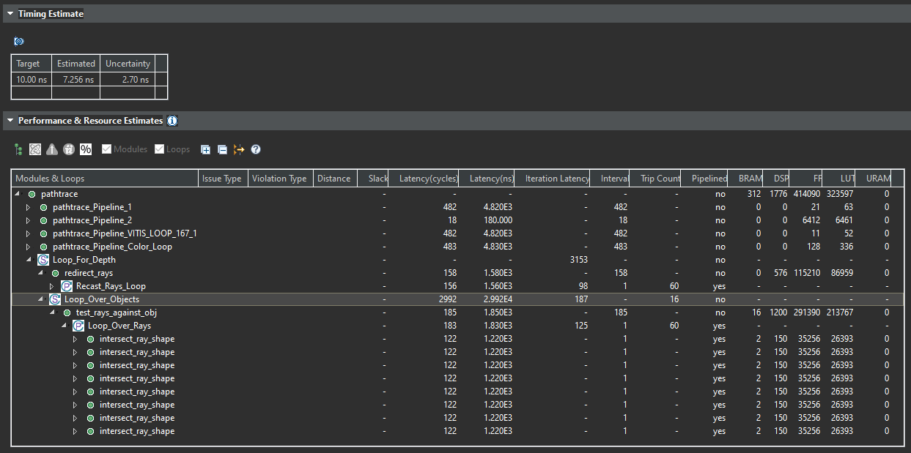
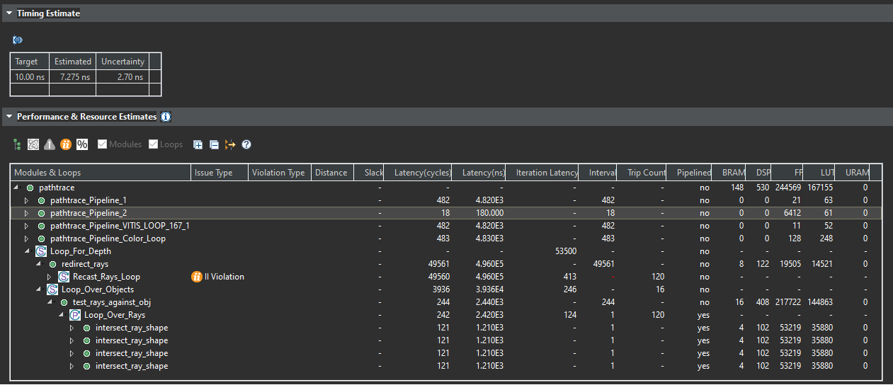

# Project Update 2

The bulk of the effort over the last several weeks has been HLS design space
exploration, mostly in the form of finding out what does and does not actually
work (either in terms of the tooling, how directives work, or hardware limitations).

The first several sections explain what has been going on for the last couple weeks, and at the bottom I have sections for the [plan going forward](#plan-for-the-rest-of-the-semester).

There is not really any code that can be run (certainly not on the PYNQ board yet), but you are welcome to download the code from the `hls-v2` directory and run the testbench.

## First attempt at HLS

An initial attempt was made to translate the entire "pathtrace" algorithm
onto hardware, with the inputs being all the `rays` to trace, the `shapes` in
the scene, and the output being the resultant `pixels` for the render.

See the `hls` directory for this initial version of the HLS code.

In order to see any actual performance improvement for this project, the main goal is to get some of the work for the ray tracing to be running in parallel. As such, attempts were made to unroll loops in the HLS code. However, this is easier said than done.

Eventually it became clear that complete partitioning of arrays not possible with the number of objects involved (480*360). (However, instead of any sort of useful message, Vitis just freezes if you try to synthesize with this mistake.)

In order to attempt a basic fix, an attempt was made to unroll to a significantly lower extent (factor of 4). Doing this allowed the code to synthesize, but the synthesis summary was nowhere closed to the desired result:



Beyond having to increase the clock period significantly and still having negative slack, this design resulted in ridiculously high overall latency, partly on account of the amounot of things being processed at the same time, and largely because no amount of parallelism actually seemed to be happening.

I fought with this version of the design for a long time, and essentially did design space exploration of interfaces and directives to sort out what worked and what didn't, but essentially nothing worked well in this design so I won't put too many details here. Eventually I realized I needed to reassess my approach to the algorithm and start from a better base.

## Reassessing

At some point I realized that the loops needed to essentially be inverted
to allow for better performance; instead of checking every shape against
every ray in parallel, every ray could be checked against every shape in parallel. The distinction here is that the loop changes from:
```
for ray in rays:
    # UNROLL
    for shape in shapes:
        do_collision_check(ray, shape)
    update_ray_based_on_closest_intersection(ray)
```
to:
```
for shape in shapes:
    for ray in rays:
        # UNROLL
        do_collision_check(ray, shape)
for ray in rays:
    update_ray_based_on_closest_intersection(ray)
```
If I understand the process of HLS as well as the results that I have been seeing correctly, this is a better access pattern since the tooling understands that there will not be multiple reads on a single shape at the same time in the second version, since the shape used is "fixed" before unrolling and processing multiple rays in parallel.

Switching to this version of the algorithm turned out to work well, as will be explained in the next section.

## Second attempt at HLS and some design space exploration

See the `hls-v2` directory for the updated and improved attempt at high level synthesis.

With the changed algorithm up and running, synthesis results looked a lot more reasonable (at least compared to v1):



However, we have to note the very large amount of BRAM usage. I didn't recognize at first that this would be more than actually available on the board, and found out that this design would not work when I exported the RTL details and made a design in Vivado. There was an error in the implementation phase when generating the bitstream that let me know that I was far exceeding the available BRAM for the board.

The design in Vivado looks like the following, regardless of the HLS code, since I decided to stick with BRAM as the interface for the top level function for all iterations:




### Initial synthesis results


Repeat of the image from above, note the very high resource usage.

The attempted solution for this was to have the toplevel interface only deal with a single row worth of rays at a time (480), and in theory the software would just have to loop over all the rows it wanted to trace and run each of them through the hardware block. That led to the following design result:

### Synthesis results when reducing interface size to a single row of pixels



Here we see much more reasonable BRAM usage, but still apparently too much DSP usage by a little bit, as found out when trying to get the design working in Vivado:



Now, ignoring the fact that we are using too many DSPs, further design space exploration was attempted to see if unrolling more would be possible:

### Synthesis results when unrolling double (still single row)



For the previous designs we had an unroll factor of 4, but in this one we doubled that to 8. We see that the `intersect_ray_shape` routine does get more instances in parallel, and the overall latency for the outer loops goes down.

### Synthesis results when switching to fixed point (still single row)



I also tried switching from floating point arithmetic to an `ap_fixed<32, 16>` representation, but I ran into II violations that I have not yet gotten to the bottom of. It seems that they originate from one of the templated hls math functions that I am using to compute the sin or cosine of a number, so I am unsure if I have any control over the issue. It may be I need to play around more with what fixed point representation works best, and another one may just work.

## Notes and other considerations

- I considered what smaller part of the algorithm could be implemented. Path tracing is a little tricky to decompose, because there are only about two steps that keep repeating: find a ray's intersection in the scene, and generate its new trajectory. The only way to maybe make the HLS design smaller would be to have the toplevel function only trace rays in parallel and find their intersection points, and return that information to the PS for use. The PS could then make decisions about whether to keep tracing rays, and if so would generate the new paths and send those back to the PL to repeat the process. This may be a viable path to investigate if I cannot get the algorithm with repeated bouncing to all work nicely in hardware.

- I tested that the second version works using the C simulation. However, it seems that there may be issues with the cosimulation. It is unclear whether this is an issue with the design, or some other trick of the tooling that I am unfamiliar with. This issue will have to be surmounted [in the next two weeks](#plan-for-the-rest-of-the-semester).

- I deprioritized the addition of random number generation to the design, and have just been using some constants in place of the two random numbers needed to generate random rays upon bouncing, so I will have to add a stream input for random numbers to the design going forwards.

## Plan for the rest of the semester

1. Determine why the co-simulation is not getting the same results as the C simulation.
    - Change the design to fix the issue if necessary
2. Talk to a TA / professor about the best way to do interfacing between the PS and PL
    - Choose between BRAM, streaming/DMA, and AXI master
    - Decide what can and cannot be partitioned, and to what extent
3. Decide whether to pare down the design further to do a single iteration of projecting rays into the scene instead of dealing with bouncing in hardware
4. Ideally by the end of the next class session (2024-04-01) commit to one version of the project to get working in hardware by the end of the week
5. Finish up the software wrapper for the hardware, ensure interfacing is all working correctly, especially if there are multiple rounds of processing that need to each be sent to the FPGA fabric
6. Take the working design and do more design space exploration to experiment with parallelism, number representations, pipelining, and the like
